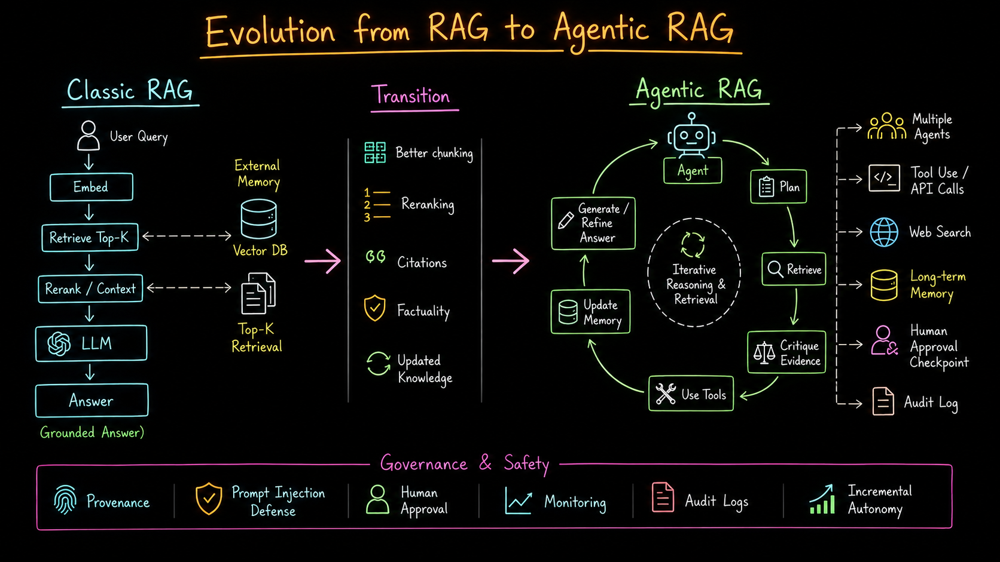
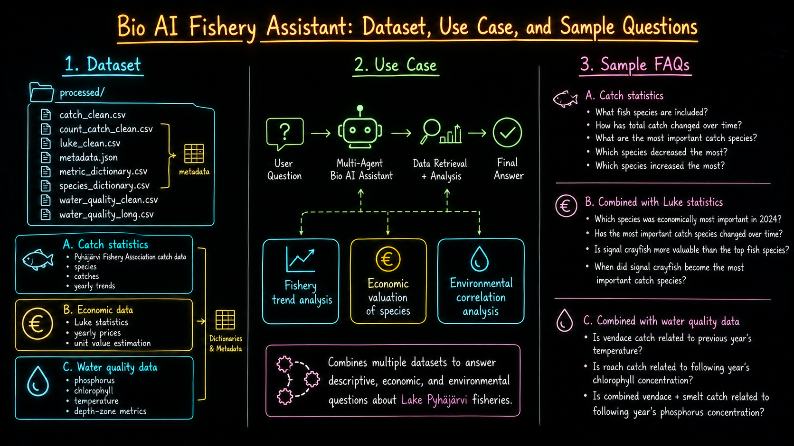
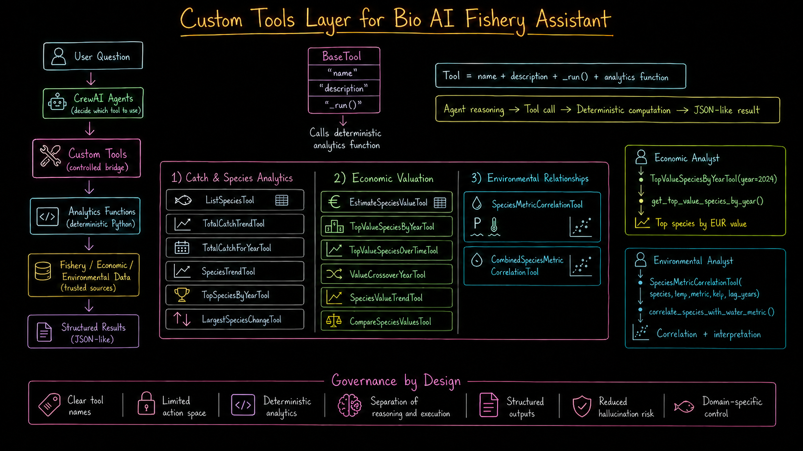
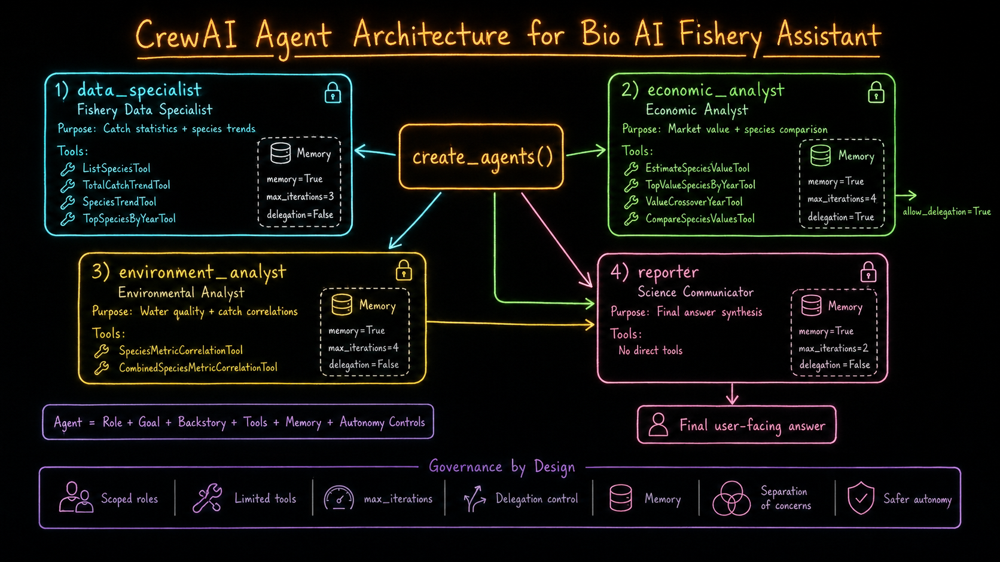
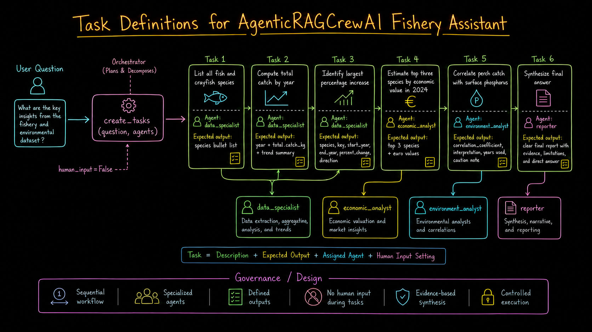
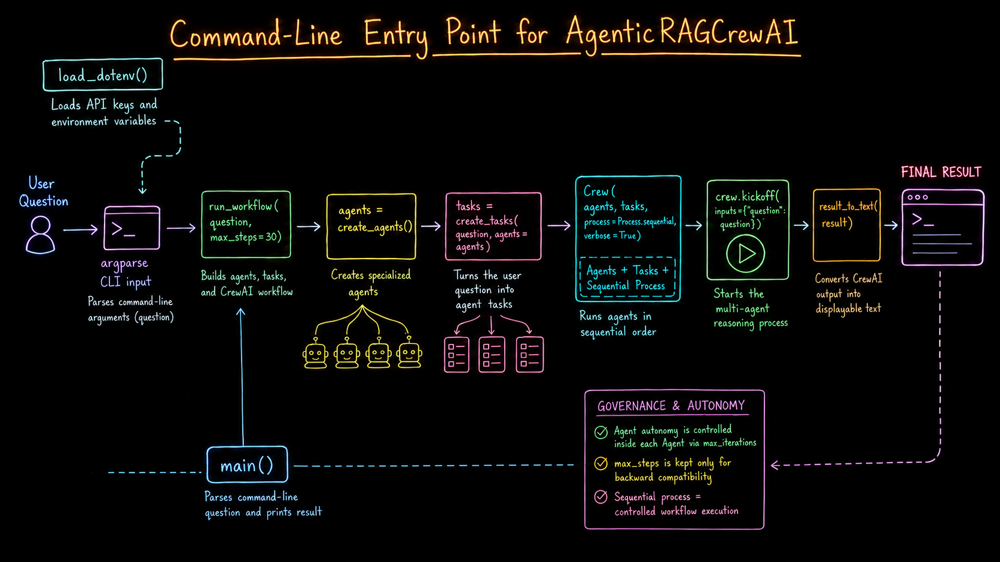
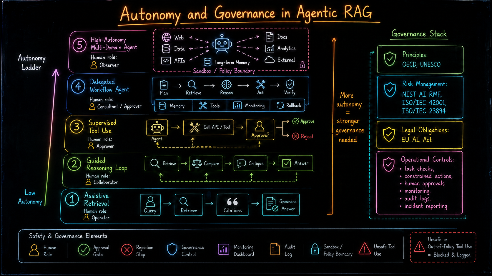

# AgenticRAGCrewAI Workshop

---

## Table of contents

1. [Workshop promise](#workshop-promise)
2. [Workshop agenda](#workshop-agenda)
3. [Slide 1 - From classic RAG to agentic RAG](#slide-1---from-classic-rag-to-agentic-rag)
4. [Slide 2 - BioAI Fishery Assistant use case](#slide-2---bioai-fishery-assistant-use-case)
5. [Slide 3 - Dataset and project structure](#slide-3---dataset-and-project-structure)
6. [Slide 4 - Custom tools layer](#slide-4---custom-tools-layer)
7. [Slide 5 - CrewAI agent architecture](#slide-5---crewai-agent-architecture)
8. [Slide 6 - Task definitions and workflow design](#slide-6---task-definitions-and-workflow-design)
9. [Slide 7 - Runtime execution from the command line](#slide-7---runtime-execution-from-the-command-line)
10. [Slide 8 - Autonomy and governance](#slide-8---autonomy-and-governance)
11. [Configuration and setup](#configuration-and-setup)
12. [Running the system](#running-the-system)
13. [Workshop exercises](#workshop-exercises)
14. [Code limitations and improvement points](#code-limitations-and-improvement-points)
15. [Quick troubleshooting](#quick-troubleshooting)

---

## Workshop promise

By the end of this workshop, participants should understand how to build a domain-specific agentic RAG system where:

- the user asks a natural-language question about Lake Pyhajarvi fishery data,
- CrewAI agents divide the work into specialized responsibilities,
- custom tools run deterministic Python analytics over trusted CSV data,
- the final answer is synthesized by a reporter agent,
- autonomy is controlled through scoped tools, max iterations, delegation settings, task design, and sequential execution.

The most important message of this workshop is:

> The LLM is not doing the calculations. The agents reason about what should be done, but trusted Python tools compute the fishery, economic, and environmental results.

---

# Slide 1 - From classic RAG to agentic RAG

 

Classic RAG is usually a fixed pipeline:

```text
User query -> Embed -> Retrieve Top-K -> Rerank/Context -> LLM -> Answer
```

That works well when the main problem is retrieving text passages. However, this fishery assistant is not only retrieving text. It must also:

- compute yearly catch totals,
- rank species by catch quantity,
- estimate economic value using Luke price statistics,
- compare species trends,
- calculate correlations with water-quality metrics,
- synthesize evidence into a final answer.

So the project moves toward an agentic pattern:

```text
Plan -> Retrieve/Analyze -> Use Tools -> Critique Evidence -> Synthesize Answer
```

## How this appears in the code

The system uses CrewAI to create agents, tasks, and a sequential crew:

```python
# process.py
agents = create_agents()
tasks = create_tasks(question, agents=agents)

crew = Crew(
    agents=list(agents.values()),
    tasks=tasks,
    process=Process.sequential,
    verbose=True,
)

return crew.kickoff(inputs={"question": question})
```

# Slide 2 - BioAI Fishery Assistant use case



This project is a BioAI fishery assistant for Lake Pyhajarvi. It combines multiple processed datasets:

- catch statistics,
- count-based catch statistics such as signal crayfish,
- Luke economic statistics,
- species dictionary,
- metric dictionary,
- water-quality statistics.

The user asks a question, the multi-agent assistant decides what analysis is needed, Python tools retrieve and compute the evidence, and a final answer is produced.

## Main question groups

### A. Catch statistics questions

The assistant should answer questions such as:

- What fish species are included in the catch statistics?
- How has the total catch of Lake Pyhajarvi developed over time?
- According to the statistics, what are the most important catch species?
- Which species decreased the most?
- Which species increased the most?
- Is there a relationship between vendace (muikku) and smelt (kuore) catches?
- Do vendace (muikku) and whitefish (siika) show similar catch trends?

### B. Combined with Luke statistics

The assistant should also answer economic questions such as:

- Which catch species is economically the most important in 2024?
- Has the most important catch species changed during the statistical period?
- Is the value of signal crayfish higher than the most economically important fish species?
- When did signal crayfish become the most important catch species?

### C. Combined with water-quality data

The assistant can also explore environmental relationships:

- Is vendace catch related to previous year's temperature?
- Is roach catch related to following year's chlorophyll concentration?
- Is combined vendace + smelt catch related to following year's phosphorus concentration?

## How this appears in the code

The processed data folder contains the trusted sources used by the analytics functions:

```text
data/processed/
  catch_clean.csv
  count_catch_clean.csv
  luke_clean.csv
  metadata.json
  metric_dictionary.csv
  species_dictionary.csv
  water_quality_clean.csv
  water_quality_long.csv
```

`analytics/data_loader.py` loads these files:

```python
def load_catch_data() -> pd.DataFrame:
    path = PROCESSED_DIR / "catch_clean.csv"
    return pd.read_csv(path)

def load_luke_data() -> pd.DataFrame:
    path = PROCESSED_DIR / "luke_clean.csv"
    return pd.read_csv(path)
```

> The processed CSV files are the knowledge base. The agents do not invent fishery data. They call tools that read these files and compute values.

---

# Slide 3 - Dataset and project structure

This is the practical bridge between the use case and the code.

## Recommended project structure

```text
AgenticRAG_CrewAI/
  agents.py                  # CrewAI agent definitions
  tasks.py                   # CrewAI task definitions
  tools.py                   # CrewAI tools wrapping analytics functions
  process.py                 # CLI runtime workflow
  streamlit_app.py           # Optional Streamlit interface
  requirements.txt           # Python dependencies
  .env.example               # Example environment file

  analytics/
    data_loader.py           # Loads processed CSV files
    trends.py                # Catch and species trend functions
    economic_rankings.py     # Economic ranking over years
    valuations.py            # Single-species value estimation
    relationships.py         # Species-water metric correlations
    species_relationships.py # Species-to-species comparison functions
    count_valuations.py      # Count-based valuation, e.g., signal crayfish
    series_engine.py         # Shared time-series alignment and interpolation

  data/
    processed/               # Cleaned fishery, Luke, and water-quality data
    raw/                     # Original source files
```

The code is organized using a clean separation of concerns:

| Layer | Files | Purpose |
| --- | --- | --- |
| Data layer | `data/processed/*.csv`, `analytics/data_loader.py` | Stores and loads trusted data |
| Analytics layer | `analytics/*.py` | Runs deterministic pandas computations |
| Tool layer | `tools.py` | Makes analytics callable by CrewAI agents |
| Agent layer | `agents.py` | Defines roles, goals, tools, and autonomy settings |
| Task layer | `tasks.py` | Defines the ordered work units |
| Runtime layer | `process.py`, `streamlit_app.py` | Runs the workflow from CLI or UI |

> The strongest design choice here is separation: agents reason, tools execute, analytics compute, and data files ground the results.

---

# Slide 4 - Custom tools layer



This is the most important implementation slide. It shows how the system controls LLM behavior through tools.

Each CrewAI tool follows this pattern:

```text
Tool = name + description + _run() + analytics function
```

The LLM sees the tool name and description. When the agent chooses a tool, the `_run()` method calls deterministic Python code.

## How this appears in the code

Example from `tools.py`:

```python
class ListSpeciesTool(BaseTool):
    name: str = "list_species"
    description: str = "List all fish and crayfish species in the catch dataset."

    def _run(self) -> Any:
        return list_available_species()
```

Another example:

```python
class TopValueSpeciesByYearTool(BaseTool):
    name: str = "top_value_species_by_year"
    description: str = "Return the top N species by estimated economic value in a given year."

    def _run(self, year: int, limit: int = 5) -> Any:
        return get_top_value_species_by_year(year, limit)
```

## Tool groups in this project

### 1. Catch and species analytics

These tools answer descriptive fishery questions:

```text
ListSpeciesTool
TotalCatchTrendTool
TotalCatchForYearTool
SpeciesTrendTool
TopSpeciesByYearTool
LargestSpeciesChangeTool
```

They wrap functions from `analytics/trends.py`, such as:

```python
df.groupby("year")["catch_kg"].sum()
```

### 2. Economic valuation tools

These tools combine catch statistics with Luke price statistics:

```text
EstimateSpeciesValueTool
TopValueSpeciesByYearTool
TopValueSpeciesOverTimeTool
ValueCrossoverYearTool
SpeciesValueTrendTool
CompareSpeciesValuesTool
```

The core economic idea is:

```text
estimated_value_eur = catch_kg * price_eur_per_kg
```

### 3. Environmental relationship tools

These tools compute correlations between catch and water-quality metrics:

```text
SpeciesMetricCorrelationTool
CombinedSpeciesMetricCorrelationTool
```

They support questions such as:

```text
Is perch catch correlated with surface phosphorus?
Is combined vendace + smelt catch related to phosphorus?
```

## Governance by design in this slide

This tool layer is a governance mechanism because:

- tool names are explicit,
- tool descriptions guide the agent,
- tool access is limited per agent,
- calculations are deterministic,
- outputs are structured as dictionaries or lists,
- sources are often included in returned results.

## Important workshop note

Some useful analytics functions already exist but are not yet exposed as CrewAI tools:

```text
analytics/species_relationships.py
  correlate_species_with_species()
  compare_species_trends()

analytics/count_valuations.py
  compare_count_item_to_top_fish_by_year()
  compare_count_item_to_top_fish_over_time()
  find_count_item_vs_top_fish_crossover()
```

These are perfect extension exercises because they directly support questions about vendace vs smelt and signal crayfish vs top fish species.

---

# Slide 5 - CrewAI agent architecture



This slide maps to `agents.py` and explains the multi-agent design.

The system creates four agents:

```text
data_specialist
economic_analyst
environment_analyst
reporter
```

Each agent has:

```text
role + goal + backstory + tools + memory + autonomy controls
```

## Agent 1: data_specialist

Purpose: catch statistics and species trends.

Tools:

```text
ListSpeciesTool
TotalCatchTrendTool
TotalCatchForYearTool
SpeciesTrendTool
TopSpeciesByYearTool
LargestSpeciesChangeTool
```

Autonomy settings:

```python
memory=True
max_iterations=3
allow_delegation=False
```

> This agent is intentionally scoped. It cannot call economic tools or environmental tools.

## Agent 2: eeconomic_analyst

Purpose: market value, price-based valuation, and species comparison.

Tools:

```text
EstimateSpeciesValueTool
TopValueSpeciesByYearTool
TopValueSpeciesOverTimeTool
ValueCrossoverYearTool
SpeciesValueTrendTool
CompareSpeciesValuesTool
```

Autonomy settings:

```python
memory=True
max_iterations=4
allow_delegation=True
```

> The economic analyst has slightly more autonomy because economic valuation may require comparing species, years, and prices. But its action space is still limited to economic tools.

## Agent 3: environment_analyst

Purpose: water quality and catch correlations.

Tools:

```text
SpeciesMetricCorrelationTool
CombinedSpeciesMetricCorrelationTool
```

Autonomy settings:

```python
memory=True
max_iterations=4
allow_delegation=False
```

> This agent handles correlations, but correlation should be explained carefully. Correlation does not prove causation.

## Agent 4: reporter

Purpose: final answer synthesis.

Tools:

```text
No direct tools
```

Autonomy settings:

```python
memory=True
max_iterations=2
allow_delegation=False
```

> The reporter is intentionally tool-less. It should synthesize previous outputs, not invent new calculations.

## How CrewAI parameters control autonomy

| Parameter | Where used | Meaning |
| --- | --- | --- |
| `tools=[...]` | `agents.py` | Limits what each agent can do |
| `memory=True` | `agents.py` | Lets an agent retain context during the run |
| `max_iterations=...` | `agents.py` | Limits how many reasoning/tool-use loops the agent can perform |
| `allow_delegation=True/False` | `agents.py` | Controls whether an agent can delegate work |
| `Process.sequential` | `process.py` | Forces tasks to run in a defined order |
| `human_input=False` | `tasks.py` | Allows automated execution without manual approval |

## Important correction

The diagram says `create_agents()`. In the code, that function lives in:

```text
agents.py
```

That is the file to open when explaining the agent architecture.

---

# Slide 6 - Task definitions and workflow design



This slide maps to `tasks.py`.

A CrewAI task is a structured unit of work:

```text
Task = Description + Expected Output + Assigned Agent + Human Input Setting
```

Your code creates six tasks:

| Task | Assigned agent | Purpose | Expected output |
| --- | --- | --- | --- |
| Task 1 | `data_specialist` | List all species | Species bullet list |
| Task 2 | `data_specialist` | Compute total catch by year | Year + total catch kg + trend summary |
| Task 3 | `data_specialist` | Identify largest percentage increase | Species, years, percent change, direction |
| Task 4 | `eeconomic_analyst` | Estimate top species by economic value in 2024 | Top three species + EUR values |
| Task 5 | `environment_analyst` | Correlate perch catch with surface phosphorus | Correlation coefficient + interpretation |
| Task 6 | `reporter` | Synthesize final report | Evidence-based final answer |

## How this appears in the code

Example from `tasks.py`:

```python
Task(
    description=(
        f"User question: {question}\n\n"
        "Compute the total catch in kilograms for each available year. "
        "Return year and total catch values, and highlight the overall trend."
    ),
    expected_output="A list/table of year and total_catch_kg values plus a short trend summary.",
    agent=agents["data_specialist"],
    human_input=False,
)
```

## Governance by task design

The task layer controls behavior because every task has:

- a clear goal,
- an assigned agent,
- a defined expected output,
- a human-input setting,
- a predictable order in the workflow.

## Important code reality

The current `create_tasks(question, agents)` function is intentionally fixed for workshop clarity. Even if the user asks one narrow question, the demo workflow still runs all six tasks.

This is useful in a workshop because it shows all agents and tools, but a production system could make task planning dynamic.

Possible future improvement:

```text
User question -> planner -> only the necessary tasks -> final answer
```

---

# Slide 7 - Runtime execution from the command line



This slide maps to `process.py` and `streamlit_app.py`.

The runtime path is:

```text
load_dotenv()
-> argparse CLI input
-> run_workflow(question, max_steps=30)
-> create_agents()
-> create_tasks(question, agents)
-> Crew(agents, tasks, process=Process.sequential)
-> crew.kickoff(inputs={"question": question})
-> result_to_text(result)
-> final printed answer
```

## How this appears in the code

`process.py`:

```python
def run_workflow(question: str, max_steps: int = 30) -> Any:
    agents = create_agents()
    tasks = create_tasks(question, agents=agents)

    crew = Crew(
        agents=list(agents.values()),
        tasks=tasks,
        process=Process.sequential,
        verbose=True,
    )

    return crew.kickoff(inputs={"question": question})
```

## Important autonomy note

`max_steps` is kept for backward compatibility, but it is not passed into `crew.kickoff()`.

The code comment explains that current CrewAI versions control agent limits through each agent's `max_iterations` setting.

So autonomy is controlled mainly through:

```text
Agent max_iterations
Agent tool access
Agent delegation setting
Task structure
Sequential process
Human input gates
```

## Running from CLI

```bash
python process.py "Which catch species is economically most important in 2024?"
```

Default question:

```text
Is crayfish more valuable than fish? When did it become the most important species?
```

## Running with Streamlit

```bash
streamlit run streamlit_app.py
```

The Streamlit app calls the same workflow:

```python
result = run_workflow(question.strip())
st.write(result_to_text(result))
```

---

# Slide 8 - Autonomy and governance



The system is not fully autonomous. It is a controlled workflow with bounded autonomy.

## Where this project sits on the autonomy ladder

This project is around Level 3 to Level 4:

- It can use tools automatically.
- It can complete multi-step workflows.
- It has specialized agents.
- It runs without human input in the current demo.
- But it is constrained by roles, tools, task order, max iterations, and deterministic analytics.

## Governance mechanisms in the code

| Governance mechanism | Code location | Why it matters |
| --- | --- | --- |
| Scoped roles | `agents.py` | Each agent has a limited responsibility |
| Limited tools | `agents.py` | Agents can only call assigned tools |
| Max iterations | `agents.py` | Limits reasoning/tool-use loops |
| Delegation control | `agents.py` | Prevents most agents from passing work elsewhere |
| Tool-less reporter | `agents.py` | Prevents final writer from inventing calculations |
| Expected outputs | `tasks.py` | Makes outputs more structured and checkable |
| Sequential execution | `process.py` | Makes execution predictable and auditable |
| Deterministic analytics | `analytics/*.py` | Keeps calculations grounded in pandas code |
| Source fields in outputs | `analytics/*.py` | Supports traceability |
| Human input setting | `tasks.py` | Can be turned into approval gates |

> We are not giving the LLM unlimited freedom. We are giving specialized agents limited tools, limited iterations, scoped roles, sequential tasks, and deterministic analytics functions.

## Example: governance through scoped tool access

The `data_specialist` can answer catch-trend questions, but it cannot call economic tools.

The `eeconomic_analyst` can calculate value, but it does not directly handle environmental correlations.

The `reporter` has no tools, so it can only synthesize previous results.

This is practical governance by design.

## Optional stronger governance for production

For a production version, add:

- an audit log for every run,
- tool-call logging,
- human approval for final reports,
- structured JSON output validation,
- test cases for every analytics function,
- data provenance fields for all returned values,
- a policy layer for unsafe or out-of-scope questions.

---

# Configuration and setup

## 1. Prerequisites

Recommended environment:

```text
Python 3.10+
CrewAI
OpenAI API key
pandas
python-dotenv
streamlit optional
```

The current `requirements.txt` includes:

```text
crewai
pandas
matplotlib
openai
jinja2
python-dotenv
streamlit
fastapi
uvicorn
```

## 2. Create and activate a virtual environment

macOS/Linux:

```bash
python -m venv .venv
source .venv/bin/activate
```

Windows PowerShell:

```powershell
python -m venv .venv
.\.venv\Scripts\Activate.ps1
```

## 3. Install dependencies

```bash
pip install -r requirements.txt
```

## 4. Configure environment variables

Copy the example environment file:

```bash
cp .env.example .env
```

Then edit `.env`:

```env
OPENAI_API_KEY=your_openai_api_key_here
```

Important:

- Do not commit `.env` to Git.
- Do not distribute `.env` in a workshop ZIP.
- Keep `.env.example` only.

## 5. Confirm data files exist

Before running, check that these files exist:

```text
data/processed/catch_clean.csv
data/processed/count_catch_clean.csv
data/processed/luke_clean.csv
data/processed/metric_dictionary.csv
data/processed/species_dictionary.csv
data/processed/water_quality_clean.csv
data/processed/water_quality_long.csv
```

---

# Running the system

## Option A: Run from the command line

From the project root:

```bash
python process.py "What fish species are included in the catch statistics?"
```

Example questions:

```bash
python process.py "How has the total catch of Lake Pyhajarvi developed over time?"
python process.py "Which catch species is economically the most important in 2024?"
python process.py "Is perch catch correlated with surface phosphorus?"
```

## Option B: Run the Streamlit app

```bash
streamlit run streamlit_app.py
```

Then enter a fishery question in the browser UI.

## Option C: Run a quick tool check in Python

```python
from analytics.trends import list_available_species, get_total_catch_by_year

print(list_available_species())
print(get_total_catch_by_year()[:3])
```

This is useful if CrewAI or the API key is not working but you still want to show the deterministic analytics layer.

---

# Workshop exercises

## Exercise 1 - Change an agent's autonomy

Open `agents.py` and change:

```python
max_iterations=3
```

Try increasing or decreasing it. Discuss:

- Does the agent have more room to reason?
- Does it produce longer outputs?
- Does it call tools differently?

## Exercise 2 - Add a species relationship tool

There is useful code in `analytics/species_relationships.py`:

```python
correlate_species_with_species(species_a, species_b, lag_years=0)
compare_species_trends(species_a, species_b)
```

Create a new tool in `tools.py`:

```python
class SpeciesToSpeciesCorrelationTool(BaseTool):
    name: str = "species_to_species_correlation"
    description: str = "Return correlation between catches of two species."

    def _run(self, species_a: str, species_b: str, lag_years: int = 0):
        return correlate_species_with_species(species_a, species_b, lag_years)
```

Then assign it to `data_specialist` in `agents.py`.

## Exercise 3 - Add a signal crayfish valuation tool

The file `analytics/count_valuations.py` already contains functions for count-based valuation:

```python
compare_count_item_to_top_fish_by_year(item_key, year)
compare_count_item_to_top_fish_over_time(item_key)
find_count_item_vs_top_fish_crossover(item_key)
```

Wrap one as a CrewAI tool and assign it to `eeconomic_analyst`.

This directly supports:

```text
Is signal crayfish more valuable than the top fish species?
When did signal crayfish become the most important catch species?
```

## Exercise 4 - Add a human approval gate

Open `tasks.py` and change the final synthesis task:

```python
human_input=True
```

Discuss how this changes governance.

---

# Code limitations and improvement points

## 1. The current task plan is fixed

`create_tasks()` always creates the same six tasks. This is useful for teaching, but a production version should generate tasks based on the user question.

## 2. Some use-case questions need extra tool wrappers

The analytics functions exist for species-to-species relationships and count-based valuation, but not all are exposed as CrewAI tools yet.

## 3. Full-period species increase/decrease logic should be stricter

The requirement says the assistant should consider only species that have data for the entire statistical period. The current largest-change logic uses each species' own first and last available year. 

## 4. Missing-price handling should be consistent

Some valuation logic uses nearest available year; some series logic interpolates. 

---

# Quick troubleshooting

## Problem: OpenAI key error

Check `.env`:

```env
OPENAI_API_KEY=your_openai_api_key_here
```

Then restart the terminal or app.

## Problem: import error

If imports fail, run commands from the project root. If packaging as a Python module, consider changing imports such as:

```python
from agents import create_agents
```

to relative imports:

```python
from .agents import create_agents
```

## Problem: CrewAI runs but answer is not specific

Check:

- Is the correct tool assigned to the correct agent?
- Does the task description mention the required species/year/metric?
- Does the tool return structured output?
- Is the reporter instructed to use previous task outputs?

## Problem: the exact fishery question is not answered

The current workflow runs a broad fixed demo pipeline. Add or modify a task for the exact question.

For example, for vendace and smelt:

```text
Task: Compute correlation between vendace and smelt catches.
Agent: data_specialist
Tool: SpeciesToSpeciesCorrelationTool
Expected output: correlation, years used, interpretation, caution note.
```

---

# Final workshop closing line

> This project demonstrates agentic RAG by governance-by-design: agents reason, tools calculate, tasks structure the workflow, and CrewAI parameters limit autonomy.

