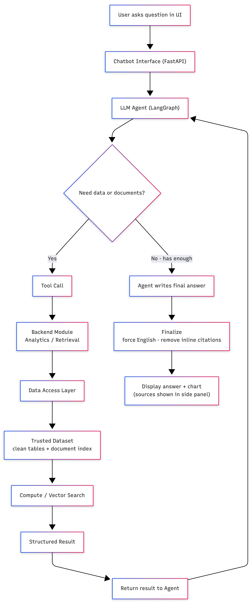

# Fully Local Open-Source Agentic RAG System

A **data-grounded analytical chatbot** that answers questions about the fishery, economic, and water-quality data of Lake Pyhäjärvi. A local LLM **orchestrates** each answer by calling analytical tools and a document-retrieval tool — it never computes numbers itself and never answers from general knowledge.

The entire stack is **open-source and runs fully locally** — no API keys, no cloud calls, no recurring cost. The LLM runs in [Ollama](https://ollama.com), the agent is orchestrated with [LangGraph](https://github.com/langchain-ai/langgraph), embeddings run via `sentence-transformers`, and the vector store is a local Chroma index.

---

## Key idea

> The chatbot does not guess. It routes each question to deterministic analytics functions (for numbers) and/or a document index (for definitions and methodology), observes the results, and synthesizes a concise, **cited** answer.

This is a genuine **agentic system**, not a single-shot router. Built as a **LangGraph state machine**, the model can call several tools in sequence, read their results, and decide what to do next. For document retrieval it applies a **corrective-RAG** step: it grades the retrieved passages and, if they are weak, reformulates the query and retrieves once more before answering. A final guard guarantees the answer is returned in English and that any sources used are cited.

---

## Architecture

The request pattern, from question to answer:

<p align="center">
  
</p>

**Clear separation of layers:**


| Layer             | Responsibility                                             | Files                                         |
| ----------------- | ---------------------------------------------------------- | --------------------------------------------- |
| UI                | Type a question; render answer + chart + tool trace        | `ui/` (React + Vite)                          |
| API               | HTTP boundary, request/response schemas                    | `app/main.py`, `app/api.py`, `app/schemas.py` |
| Orchestration     | LangGraph state machine: tool loop, corrective-RAG, guards | `app/chat.py`                                 |
| Tool interface    | 11 callable tools + JSON schemas + dispatch                | `app/agent_tools.py`                          |
| Analytics backend | Deterministic computation over the data                    | `analytics/`*, `app/tools.py`                 |
| Retrieval backend | Embedding + vector search + retrieval grading              | `analytics/document_search.py`                |
| Data pipeline     | Raw → clean CSVs; raw → vector index                       | `pipelines/*`                                 |


---

## Live agent-flow UI

The React UI doesn't just show the final answer — it **visualises the agent loop as it runs**. A streaming endpoint (`POST /chat/stream`, Server-Sent Events) instruments the LangGraph machine via `GRAPH.stream(stream_mode="updates")` and emits each step the moment it happens; the front end turns that into two synchronized views:

- **Flow graph** — an animated `Agent → Tools → Answer` node graph. The active node pulses, edges flow, completed nodes get a check, the **loop-back arc** lights up when the agent iterates, and a **corrective-RAG** badge appears when weak retrieval triggers a reformulated re-retrieval.
- **Step log** — a live timeline of the same run: the reasoning step, the tools the agent selected, each executed tool with its arguments and a result preview, any corrective-RAG retry, and the final compose. Every answer keeps a collapsible "How this answer was generated" trace.

Charts are rendered as real visuals (Recharts: line / bar / scatter / multi-line / dual-line) from the deterministic `chart_data` payloads, not raw JSON. The streamed `final` event carries the same `{answer, tool_calls, chart_data}` contract as the non-streaming `POST /chat`, which remains available unchanged.

Relevant files: `app/chat.py` (`stream_chat_response`), `app/api.py` (`/chat/stream`), `ui/src/components/AgentFlow.jsx`, `ui/src/components/StepLog.jsx`, `ui/src/components/ChartView.jsx`.

---

## Stack (all local, open-source, $0 recurring)


| Layer           | Choice                                                                             |
| --------------- | ---------------------------------------------------------------------------------- |
| LLM             | Qwen 2.5 14B Instruct via Ollama (`localhost:11434/v1`); 7B configured as fallback |
| Agent framework | **LangGraph** state machine (`langgraph`, `langchain-core`)                        |
| LLM client      | `langchain-openai` `ChatOpenAI` pointed at Ollama's OpenAI-compatible endpoint     |
| Embeddings      | `intfloat/multilingual-e5-base` (Finnish + English) via `sentence-transformers`    |
| Vector DB       | Chroma `PersistentClient` → `data/cache/vector_index/` (cosine)                    |
| Parsing         | pypdf (PDF), python-docx (DOCX), plain text (txt/md), openpyxl (Excel text)        |
| API / UI        | FastAPI + React (Vite)                                                             |


The OpenAI-compatible client is used purely as transport to Ollama — **no OpenAI account or key is involved**, and nothing leaves the machine.

---

## Data

Three real Excel sources in `data/raw/` are cleaned by `pipelines/build_processed_data.py` into analysis-ready CSVs in `data/processed/`:


| Clean file                | What it holds                                                    | Rows / span         |
| ------------------------- | ---------------------------------------------------------------- | ------------------- |
| `catch_clean.csv`         | Fish catch in kg by year & species (12 species)                  | 160 rows, 2010–2024 |
| `count_catch_clean.csv`   | Count-based catch (signal crayfish — counted, not weighed)       | 15 rows, 2010–2024  |
| `water_quality_clean.csv` | Chlorophyll, N, P, temperature by depth zone                     | 16 rows, 2010–2025  |
| `luke_clean.csv`          | Commercial quantity, value, and unit price (used to value catch) | 855 rows, 1980–2024 |


**Numeric CSVs are NOT put in the vector index** — they stay behind the analytics tools so answers are deterministic. The vector index covers only **qualitative** knowledge from `data/raw/`: the PDF report, `methodology.md`, `sample_FAQs.txt`, and non-tabular text extracted from the Excel files.

> **Generated vs. source.** `data/raw/` is the source of truth (the Excel files, the PDF, `methodology.md`, `sample_FAQs.txt`). Everything in `data/processed/` and `data/cache/` is a build artifact — safe to delete and regenerable with the two pipeline commands below.

See [Assumptions & limitations](#assumptions--limitations) for how messy data is handled.

---

## Prerequisites — install these first

You need three tools installed: **Ollama** (runs the local AI model), **Python 3.11** (the
backend), and **Node.js 18+** (the web UI). Plan for ~10 GB of free disk (the model is ~9 GB) and
ideally 16 GB+ RAM for the 14B model (an 8 GB machine should use the 7B model — see the note below).

**1. Ollama** — the local LLM runtime.

- **macOS / Windows:** download the installer from **[https://ollama.com/download](https://ollama.com/download)** and run it. This installs Ollama *and* starts it running in the background (you'll see a small icon in the menu bar / system tray).
- **macOS via Homebrew (alternative):** `brew install ollama`, then start it with `ollama serve`.
- **Linux:** `curl -fsSL https://ollama.com/install.sh | sh`, then `ollama serve`.
- Verify it works: open a terminal and run `ollama --version`.

**2. Python 3.11**

- **macOS:** `brew install python@3.11` (install [Homebrew](https://brew.sh) first if you don't have it), or download from **[https://www.python.org/downloads/](https://www.python.org/downloads/)**.
- **Windows / Linux:** download from **[https://www.python.org/downloads/](https://www.python.org/downloads/)** (on Windows, tick *"Add Python to PATH"* in the installer).
- Verify: `python3.11 --version` should print `Python 3.11.x`.

**3. Node.js 18 or newer**

- **macOS:** `brew install node`, or download from **[https://nodejs.org](https://nodejs.org)** (the "LTS" version).
- **Windows / Linux:** download the LTS installer from **[https://nodejs.org](https://nodejs.org)**.
- Verify: `node --version` should print `v18` or higher.

Once all three are installed, follow **How to run** below.

---

## How to run

> **Ollama must be running** for the backend to answer. If you used the macOS/Windows installer it
> already runs in the background — check for its menu-bar/tray icon. Otherwise start it with
> `ollama serve` in a separate terminal *before* launching the backend.

### Already set up? Quick start

If the venv, model, and vector index already exist, just start the two servers (and make sureOllama is running):

```bash
# Terminal 1 — backend
source .venv/bin/activate
uvicorn app.main:app --reload               # http://localhost:8000

# Terminal 2 — frontend
cd ui && npm run dev                        # http://localhost:5173
```

Then open **[http://localhost:5173](http://localhost:5173)**.

### First-time setup

```bash
# 0. Get the code (clone the repo, then enter the project folder)
git clone git@github.com:GPT-Laboratory/GAISE_AgenticRAG.git
cd GAISE_AgenticRAG/AgenticRAG_OpenSource
# (HTTPS instead of SSH: git clone https://github.com/GPT-Laboratory/GAISE_AgenticRAG.git)

# 1. Python environment
python3.11 -m venv .venv && source .venv/bin/activate
pip install -r requirements.txt

# 2. Local models (one-time download; ~9 GB for the 14B model)
ollama pull qwen2.5:14b-instruct
ollama pull qwen2.5:7b-instruct             # optional fallback

# 3. Build data: raw Excel → clean CSVs, and raw KB → vector index
python pipelines/build_processed_data.py    # → data/processed/*.csv
python pipelines/build_vector_index.py      # → data/cache/vector_index/ (first run downloads the e5 model)

# 4. Run the backend
uvicorn app.main:app --reload               # http://localhost:8000  (POST /chat)

# 5. Run the frontend (separate terminal)
cd ui && npm install && npm run dev         # http://localhost:5173
```

Copy `.env.example` → `.env` to override any default (model name, `RAG_TOP_K`, `RAG_SCORE_FLOOR`, `MAX_TOOL_ITERS`, frontend origin).

> **Note on `openai` / `langchain-openai` in `requirements.txt`.** These are only the client for Ollama's OpenAI-compatible endpoint (`localhost:11434/v1`) — they never call OpenAI's servers. No OpenAI account or API key is needed, and nothing leaves your machine.

> **Smaller machine?** Set `OLLAMA_MODEL=qwen2.5:7b-instruct` in `.env` and pull only the 7B model. Tool-calling quality drops somewhat but the flow is identical.
> **Want higher answer fidelity?** Set `OLLAMA_MODEL=qwen2.5:32b-instruct` (still fully local and open-source). A larger model follows the "state values exactly / answer in English" rules more reliably. Any Ollama model with tool-calling support works — only the config line changes.

---

## The tool layer

`app/agent_tools.py` exposes **11 callable tools** to the LLM, each with a strict JSON schema (`TOOL_SCHEMAS`) and a dispatch entry (`DISPATCH`). LangGraph binds these schemas to the model; the Ollama runtime returns native tool calls; the `tools` node executes them and feeds structured results back — the canonical tool-calling pattern (typed schemas, a dispatcher, structured results turned into a natural-language answer).

These 11 tools deliberately consolidate ~24 fine-grained analytics wrappers in `app/tools.py` (via enum/list parameters) because a local 14B model degrades in tool-selection accuracy past ~10–12 near-synonymous tools. The analytics logic itself is **not** rewritten by this layer.


| Tool                     | Purpose                                                            |
| ------------------------ | ------------------------------------------------------------------ |
| `list_data_dimensions`   | List available species / count-items / metrics                     |
| `get_catch`              | Catch in kg: per year, total trend, top-N, single-species trend    |
| `get_largest_change`     | Largest relative increase/decrease over the period                 |
| `estimate_value`         | Economic value (€) of a species in a year (catch × price)          |
| `rank_value_species`     | Rank species by value; detect if the leader changed over time      |
| `value_trend_or_compare` | Value trend, two-species comparison, value crossover year          |
| `compare_species_catch`  | Two-species catch trend comparison or (lagged) correlation         |
| `correlate_with_metric`  | Correlate catch with water-quality metric(s), with optional lag    |
| `count_item_analysis`    | Signal-crayfish value vs the top fish species (incl. crossover)    |
| `forecast_catch`         | Simple trend projection of a species' catch                        |
| `document_search`        | Vector retrieval over the KB for definitions / methodology / units |


---

## Sample questions → how they are answered


| Sample question                                   | Tool(s) used                                                  |
| ------------------------------------------------- | ------------------------------------------------------------- |
| What fish species are included?                   | `list_data_dimensions(kind=species)`                          |
| How has total catch developed?                    | `get_catch(mode=total_trend)` → line chart                    |
| What are the most important catch species?        | `get_catch(mode=top_overall)`                                 |
| Relationship between vendace and smelt catches?   | `compare_species_catch(mode=correlation)`                     |
| Do vendace and whitefish show similar trends?     | `compare_species_catch(mode=trend_comparison)`                |
| Which species decreased / increased the most?     | `get_largest_change(direction=…)`                             |
| Most economically important species in 2024?      | `rank_value_species(year=2024)` → bar chart                   |
| Has the most valuable species changed over time?  | `rank_value_species(check_changed=true)`                      |
| Is signal crayfish worth more than the top fish?  | `count_item_analysis(mode=vs_top_fish_over_time / crossover)` |
| Vendace catch vs **previous** year's temperature? | `correlate_with_metric(lag_years=1)` → scatter                |
| Roach catch vs **following** year's chlorophyll?  | `correlate_with_metric(lag_years=-1)`                         |
| What does "crayfish" refer to here?               | `document_search` → cited answer                              |


---

## Verification checklist

- **Numeric:** "How has the total catch developed?" → `get_catch`, line chart, numbers match the CSV exactly (e.g. 522,300 kg in 2010 → 586,490 kg in 2024).
- **Definitional:** "What does crayfish refer to here?" → `document_search`, answer cites `(methodology.md)`.
- **Economic:** "Most important species in 2024?" → `rank_value_species(year=2024)` → perch at €226,845.43, bar chart.
- **Lagged correlation:** "Vendace vs previous year's bottom temperature?" → `correlate_with_metric(lag_years=1)` → 0.235 (weak positive), scatter.
- **Corrective-RAG:** a vague document query → two `document_search` entries in `tool_calls` (original + reformulated).
- **Language guard:** if the local model drifts out of English, the `finalize` node translates the answer back while preserving every number and citation.
- **Safety:** a nonsense query → graceful answer, no 500; the iteration cap holds.

---

## Assumptions & limitations

**Data handling (real-world, imperfect):**

- Excel sources have inconsistent headers, units, and time resolutions; the pipeline normalizes them to tidy per-year CSVs with canonical `species_key` / `metric_key` columns.
- Species appear in Finnish and English; `app/normalize.py` holds the alias map and coerces model-supplied names to a single key at call time (so `ahven`, `Perch`, and `perch` all resolve).
- **Valuation:** value = catch × unit price, where unit price is derived from Luke commercial statistics. Missing prices are estimated from the nearest available years (per `methodology.md`).
- **Signal crayfish** is counted, not weighed, so it uses **count-based** valuation rather than €/kg, and is compared to fish on value (€) rather than mass.
- "Increased the most over the full period" considers only species with data spanning the period.

**System limitations:**

- Correlations are descriptive, not causal; lag analysis is a simple year-shift, not a fitted time-series model.
- The "predictive" angle is intentionally light (trend/lag/correlation); `forecast_catch` is a simple projection, not a trained model.
- Answer quality depends on the local model. The 14B handles multi-tool questions well but can occasionally mislabel in prose; a larger model (32B) closes most of that gap.
- Corrective-RAG retries **once**; a persistently weak query is answered with whatever was found.

---

## Reflection

**What I would improve with more time**

- A genuine lightweight forecaster (linear trend or a small tree model) behind `forecast_catch`, so predictive questions get an actual projection with a confidence note.
- Stream the final answer token-by-token (the live LangGraph step trace and flow graph already stream via `/chat/stream`; only per-token answer streaming remains).
- An automated eval set over the sample questions (golden tool calls + numeric assertions) in CI, so regressions in routing or analytics are caught.
- Richer chunking/metadata for retrieval (section-aware splits, per-source weighting).

**Making it robust for real-world use**

- Schema/units validation on ingestion with explicit failure on unexpected layouts.
- Tool-result caching and timeouts; structured logging of every tool call for auditability.
- Authentication, rate limiting, and a guardrail that refuses to answer when no tool returned grounded data (already partly present via the "no grounded answer" fallback).
- Pin model + embedding versions and snapshot the index, so answers are reproducible.

---

## Project structure

```
app/
  main.py            FastAPI app + CORS
  api.py             /chat endpoint
  schemas.py         request/response models
  chat.py            LangGraph state machine (agent / tools / finalize, corrective-RAG, guards)
  agent_tools.py     11 tool schemas + dispatch
  tools.py           fine-grained analytics wrappers
  charts.py          chart_data builders for the UI
  normalize.py       species/metric alias maps + arg coercion
  config.py          settings (Ollama, embeddings, RAG, loop)
analytics/           deterministic analytics + document_search retrieval
pipelines/
  build_processed_data.py   raw Excel → clean CSVs
  build_vector_index.py     data/raw/* → parse → chunk → embed → Chroma
data/
  raw/               source files: Excel + PDF + methodology.md + sample_FAQs.txt (indexed)
  processed/         clean, analysis-ready CSVs (behind the tools) — generated
ui/                  React (Vite) chat interface
```

