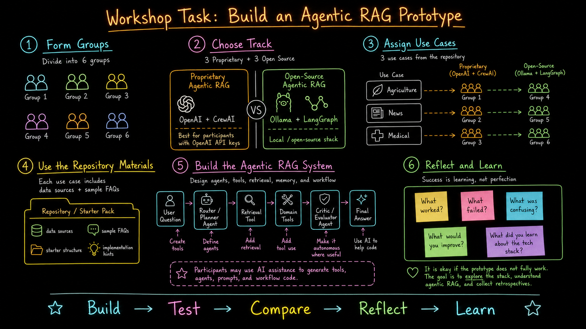
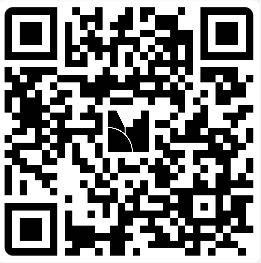

# Build an Agentic RAG Prototype

**Workshop theme:** Agentic RAG from retrieval to autonomy  
**Demo use case:** Bio AI Fishery Assistant for Lake Pyhäjärvi  
**First implementation track:** Proprietary Agentic RAG with **OpenAI + CrewAI**  
**Second implementation track:** Open-source Agentic RAG with **Ollama + LangGraph**

---

## Workshop task

In this hands-on activity, participants will work in groups to design and build a small **Agentic RAG prototype**.

The goal is not to build a perfect production system. The goal is to understand how an Agentic RAG system is structured, how agents use tools, how retrieval is connected to reasoning, and how autonomy can be controlled through workflow design.

---

## How we will conduct the workshop

### 1. Form groups

Participants will be divided into **6 groups**.

### 2. Choose implementation track

There will be two implementation tracks:

- **Proprietary Agentic RAG:** OpenAI + CrewAI
- **Open-source Agentic RAG:** Ollama + LangGraph

Suggested split:

- Groups 1–3: OpenAI + CrewAI
- Groups 4–6: Ollama + LangGraph

### 3. Assign use cases

Each group will choose or receive one use case from the repository materials.

Example use-case areas:

- Agriculture
- News
- Medical

### 4. Use the repository materials

Each use case includes starter materials such as:

- data sources
- sample FAQs
- starter structure
- implementation hints

### 5. Build the Agentic RAG prototype

Each group should try to create a simple workflow with:

- a user question
- a router or planner agent
- a retrieval component
- one or more domain tools
- an optional critic/evaluator agent
- a final answer generator

Participants may use AI assistance to generate agents, tools, prompts, and workflow code.

### 6. Test, compare, and reflect

At the end, each group should reflect on:

- What worked?
- What failed?
- What was confusing?
- What would you improve?
- What did you learn about the technology stack?

The workshop mindset is:

> **Build → Test → Compare → Reflect → Learn**

---

## Mentimeter retrospective

At the end of the workshop, each group will submit their retrospective using Mentimeter.

**Mentimeter link:** https://www.menti.com  
**Code:** `6541 6879`

---

## Expected group output

Each group should aim to produce:

1. A working or partially working Agentic RAG prototype.
2. A short explanation of the chosen architecture.
3. A list of agents and tools used.
4. One example question and answer.
5. A short retrospective submitted through Mentimeter.

It is okay if the prototype does not fully work. The purpose is to explore the stack, understand Agentic RAG, and learn through implementation.
